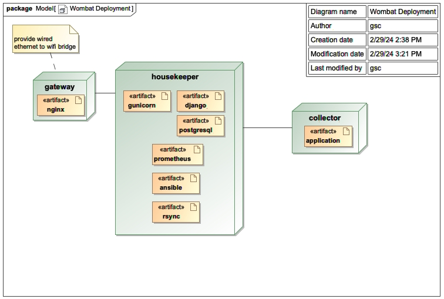

# mellow-wombat

Physical packaging + provisioning + operations tooling for “crate” based RF collection systems.

This repo is about the **infrastructure around the collectors**: host provisioning, fleet catalog/tasking, boot-time config, ansible helpers, and a Debian package used on crate hosts. The collector applications themselves live in separate repos (examples below).

## What is a “crate”?

A Mellow Wombat deployment is a ruggedized box containing:

- **Gateway**: single board computer that bridges crate Ethernet ("wombatnet") to outside connectivity, provides services (time, logging, routing), and coordinates the collectors.
- **Collectors**: SBCs + receivers that run one of the “mellow-*” collection apps.
- **Shared physical infrastructure**: power distribution, Ethernet, RF distribution/multicouplers.

The wooden insert is designed around a storage bin footprint; see the physical layout reference image in [grafix/crate_dimensions.png](grafix/crate_dimensions.png).

## Key features (in this repo)

- **Fleet catalog as JSON**: a single source of truth for crates, hosts, IPs, roles, and assigned receiver/tasks (see [infra/var/wombat/admin/catalog.json](infra/var/wombat/admin/catalog.json)).
- **Generator**: turns the catalog into:
  - `/etc/hosts` entries
  - an Ansible inventory
  - an rsync helper script
  via [bin/generator.sh](bin/generator.sh) and the Python code under [src/generator/](src/generator/).
- **BootBoy**: a one-shot boot-time configurator that reads `/var/wombat/admin/<hostname>.json` and writes a status JSON; see [src/bootboy/README.md](src/bootboy/README.md).
- **Debian package + apt repo metadata**: installs the base “wombat” environment (user, directory layout, dependencies). See [mellow_wombat_package_1.0_all/](mellow_wombat_package_1.0_all/) and packaging helpers like [bin/prepare-deb.sh](bin/prepare-deb.sh).
- **Ops scripts**: helper scripts for syncing admin config, validating/archiving/scoring collections, and preparing gateway storage (see [bin/](bin/)).
- **Provisioning docs**: step-by-step notes for gateway and collector configuration in [infra/](infra/), e.g. [infra/odroidn2_config.md](infra/odroidn2_config.md) and [infra/checklist.md](infra/checklist.md).

## Deployment model

One gateway manages a set of collectors (all wired Ethernet inside the crate):



### Gateway

Typically an Odroid N2 + large USB storage (e.g. 4TB Passport). The gateway provides outside connectivity (wired or WiFi), routing/NAT for collectors, and crate services.

- Gateway provisioning: [infra/odroidn2_config.md](infra/odroidn2_config.md)
- Storage prep + cloning:
  - Partition/format a Passport drive: [bin/passport-prep.sh](bin/passport-prep.sh)
  - Copy a bootable USB stick image to Passport: [bin/odroid-n2.sh](bin/odroid-n2.sh)

### Collectors

Collectors are usually Raspberry Pi or Odroid devices with one or more supported “tasks” declared in the catalog. Boot-time task assignment/config is handled via BootBoy.

## Collector applications (separate repos)

This repository does not contain the RF collection applications themselves. Common collector apps include:

- https://github.com/guycole/mellow-heeler
- https://github.com/guycole/mellow-hyena
- https://github.com/guycole/mellow-manatee
- https://github.com/guycole/mellow-koala

## Typical operator workflow

1. Edit the fleet catalog (or pull it from S3):
	- Local canonical catalog example: [infra/var/wombat/admin/catalog.json](infra/var/wombat/admin/catalog.json)
	- Sync admin files from S3 into `/var/wombat/admin`: [bin/admin-copy.sh](bin/admin-copy.sh)
	- Publish catalog to S3 (adds creation timestamps): [bin/catalog.sh](bin/catalog.sh)

2. Generate derived files from the catalog (run on a gateway as root):

	One-time setup on the gateway (creates the generator virtualenv expected by `bin/generator.sh`):

	```bash
	cd src/generator
	python3 -m venv venv
	./venv/bin/pip install -r requirements.txt
	```

	```bash
	sudo ./bin/generator.sh
	```

	This updates `/etc/hosts`, writes an Ansible inventory under [src/ansible/inventory.yaml](src/ansible/inventory.yaml), and writes an rsync helper script at `./bin/rsync.sh`.

3. Install and enable BootBoy on a collector:

	```bash
	./bin/bootboy-install-systemd.sh
	systemctl status bootboy.service
	```

	See BootBoy details and troubleshooting in [src/bootboy/README.md](src/bootboy/README.md).

4. Run simple Ansible actions against collectors (examples):

	- Playbooks live in [src/ansible/](src/ansible/)
	- Inventory lives in [src/ansible/inventory.yaml](src/ansible/inventory.yaml)

## Debian package / installation

This repo is also used as an apt repository for the `mellow-wombat` Debian package.

- Package definition + payload: [mellow_wombat_package_1.0_all/](mellow_wombat_package_1.0_all/)
- Repo metadata files at the repo root: `Packages`, `Release`, `InRelease`, and `KEY.gpg`

Installation steps are documented in [infra/odroidn2_config.md](infra/odroidn2_config.md) (search for “Install Debian Mellow Wombat Package”).

## Repo layout

- [bin/](bin/): operator scripts (storage prep, S3 sync/publish, docker validation helpers, package preparation)
- [infra/](infra/): provisioning docs, systemd/rsyslog/netplan snippets, postgres notes, and example `/var/wombat/admin/*` files
- [src/bootboy/](src/bootboy/): BootBoy boot-time configurator + systemd unit reference
- [src/generator/](src/generator/): catalog-driven file generators (hosts, inventory, rsync, config)
- [src/ansible/](src/ansible/): minimal Ansible playbooks (apt update, reboot, shutdown, hello)
- [crate/](crate/): per-crate notes/status
- [grafix/](grafix/): build/assembly photos and diagrams
- [src/docker_stub/](src/docker_stub/): tiny containerized stub app (useful for bring-up)

## Crate catalog

| Crate | Status |
| ----- | ------ |
| [01](crate/crate01.md) | Tasked |
| [02](crate/crate02.md) | Available |
| [03](crate/crate03.md) | Development |
| [04](crate/crate04.md) | Tasked |
| [05](crate/crate05.md) | Planned |
