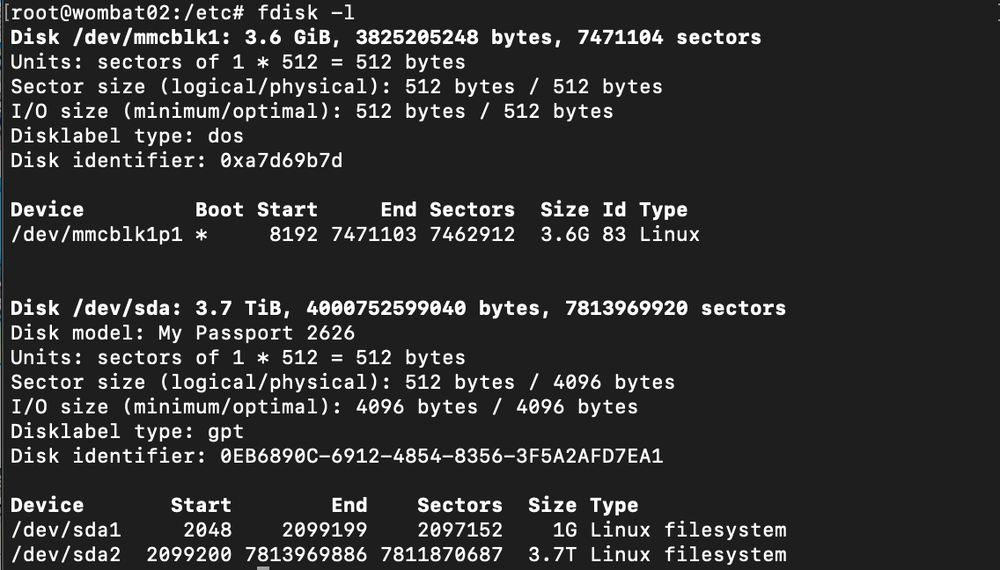

# BeagleBoneBlack
How to configure the BBB as a Mellow Wombat host.

## Assemble Hardware [BOM.md](./BOM.md)
1. Powered USB hub
1. USB WiFi dongle
1. USB GPS receiver
1. USB hard drive
1. Wired ethernet hub
1. Optional shelf power control relays and cape.

## Configure BeagleboneBlack
1. Flash fresh Debian image
    1. [AM3358 Debian 10.3 2020-04-06 4GB SD IoT](https://debian.beagleboard.org/images/bone-debian-10.3-iot-armhf-2020-04-06-4gb.img.xz)
    1. vmlinuz-4.19.94-ti-r42

1.  Change hostname to "wombatXX"
    1. hostnamectl set-hostname wombat02
    1. update [/etc/hosts](./hosts) 

1.  Configure for WiFi
    1. https://www.fis.gatech.edu/how-to-configure-bbw-wifi/

1.  Get latest versions
    1. apt-get update/upgrade

1.  Remove node, bonescript, et al
    1. apt-get purge c9-core-installer
    1. apt-get remove bonescript
    1. apt-get remove nodejs

1. Remove HDMI audio and video in uEnv
    1. https://ofitselfso.com/BeagleNotes/Disabling_Video_On_The_Beaglebone_Black_And_Running_Headless.php

1.  Install additional packages
    1. apt-get install emacs
    1. apt-get install gps
    1. apt-get install gpsd-clients
    1. apt-get install gunicorn
    1. apt-get install locales
    1. apt-get install ntp
    1. apt-get install prometheus

1.  Install python packages
    1. pip3 install virtualenv

1.  Tweak locale to support 24 hour date(1)
    1. update [/etc/default/locale](./locale) 

1.  Configure networking
    1. WiFi gateway (provides DNS)
    1. wired client shelves route to housekeeping shelf
    1. update [/etc/network/interfaces](./interfaces)
    1. update /etc/sysctl.conf to enable ip_forward

1.  To use IP masquerade 
    1. wlan0 should be active
    1. iptables -t nat -A POSTROUTING -o wlan0 -j MASQUERADE
    1. might need to delete bogus route 8.8.8.8

1.  Add wombat account
    1. useradd -m wombat 
    1. adduser wombat sudo (ensure bash shell)
    1. add .bash_aliases
    1. crontab -e (to create stubbed crontab)
    1. add github key

1.  Configure USB drives
    1. two partitions, gpt label, ext4 filesystems
        1. p1 for code sources, etc
        1. p2 for logs, collected data, etc
        1. 
    1. update [/etc/fstab](./fstab) to mount drive at boot

1.  jove /var/log and /var/spool to USB drive
    1. copy /var to partition p2
    1. ln -s /mnt/p2/var/log /var/log
    1. ln -s /mnt/p2/var/spool /var/spool
    1. reboot

1.  Update rsyslog configuration
    1. enable UDP remote loghost, etc, inhibit WPA suppicant messages
    1. update [/etc/rsyslog.conf](./rsyslog.conf) 
    1. iptables -A INPUT -p udp --dport 514 -j ACCEPT
    1. systemctl status rsyslog.service 
    1. systemctl restart rsyslog.service
    1. logger -i testaroo
    1. logger -i -p local3.info ryryry
    1. logger -i -t local3.info ryryry
    1. remote computers need "*.* @IP" before rules
    1. TODO: logrotate instructions

1.  Enable prometheus to scrape application shelves
    1. Remote rPi
        1. apt-get install prometheus-node-exporter
        1. systemctl status prometheus-node-exporter.service
        1. curl http://localhost:9100/metrics
    1. Wombat BB
        1. update [/etc/prometheus/prometheus.yml](./prometheus.yml) to scrape rPi
        1. systemctl restart rsyslog.service
        1. http://wombat:9090/targets should show rPi scrape

